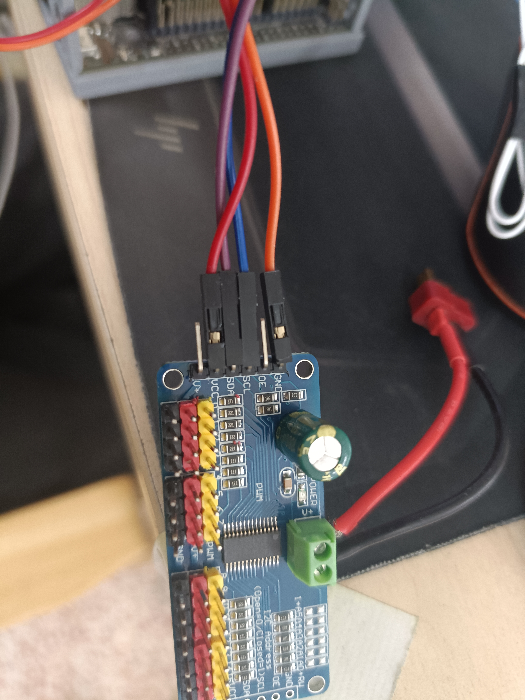
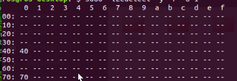

# 有关直接调用jetson nano I2C接口驱动PCA9685驱动板的说明
~~仅个人理解，还望指正~~
## jetson nano40引脚说明
```doc
    jetson Nano上带有40个引脚，分别有不同的功能，我们主要这次是说明其中的I2C接口，Jetson Nano上有2个I2C接口，一个接口战两个引脚，分别是
    SDA,SCL，其中引脚位分别是总线0：27，28 总线1：3，5 分别对应着一条总线，根据需求可以选择5种工作模式。（这里说明一下，SDA是数据线，
    在后续对地址传输信息时候主要用的线，SCL是控制线，也是时钟线，用于控制周期）练线上，因为一直显示不错总线1的地址，最后选择了总线0
    将PCA9685驱动板上的SDA与jetson nano 上的27（I2C_1_SDA）相连，SCL与28（I2C_1_SCL）相互连，然后将VCC借在3.3V的电源接口，GEN接地
    连线上的说明就是这样了。
```
  <br />
  <br />

## 供电以及使用方法
```doc
    在完成基本连线后，还需要找到一个5-10V的外接电源，过大可能引起接线过热损害器件，并且注意绝对不能反接，驱动板是没有保护机制的，反接后大概率损坏。
    找到外接电源后接入两个外接VCC GEN，起到供电作用，除了最小的驱动舵机，其他元器件都需要外接电源才能工作。至此，基本的准备算是完成了，然后就是
    气泵，电磁阀连接问题，具体可以看商家的视频，算是详细的了，假设这些连接好后，我们选择驱动板上的16个PWM接口中的两个，连接好，并记住位置，接下来
    是代码和jetson设备问题。

```

## jetson设备问题
---
    首先，我们需要对jetson的系统做一些处理，在我们自己烧录系统后，I2C是默认在黑名单中的，也就是默认关闭的的，需要手动开启，
    通过终端，在 使用vim 进入到/etc/modprobe.d/blacklist.conf 中，注释掉 blacklist i2c_i801 
---
  <br />

    然后保存退出，再然后，通过 vim 进入到/etc/modules 中，在的最后面追加i2c-dev 保存后， <br />

  <br />

    再在终端中输入， sudo reboot 重启，此致就完成了I2C的设置。
    最后就是一些必要的库的安装
    sudo apt-get install i2c-tools//这是用来查看I2C总线通道的地址，方便检查I2C是否成功连接上。
    sudo apt-get install python3-smbus //这是最主要的库，直接涉及到控制操作
    sudo apt-get install libi2c-dev
    如果安装遇到问题，类似无法找到软件包这类，请更换镜像源
    先 cp /etc/apt/sources.list /etc/apt/sources.list.bak 备份原来的文件
    再cd /etc/apt/sources.list进入镜像源文件中，将下列覆盖掉原内容，这里推荐的是阿里源
    deb http://mirrors.aliyun.com/ubuntu/ bionic main restricted universe multiverse
    deb http://mirrors.aliyun.com/ubuntu/ bionic-security main restricted universe multiverse
    deb http://mirrors.aliyun.com/ubuntu/ bionic-updates main restricted universe multiverse
    deb http://mirrors.aliyun.com/ubuntu/ bionic-proposed main restricted universe multiverse
    deb http://mirrors.aliyun.com/ubuntu/ bionic-backports main restricted universe multiverse
    deb-src http://mirrors.aliyun.com/ubuntu/ bionic main restricted universe multiverse
    deb-src http://mirrors.aliyun.com/ubuntu/ bionic-security main restricted universe multiverse
    deb-src http://mirrors.aliyun.com/ubuntu/ bionic-updates main restricted universe multiverse
    deb-src http://mirrors.aliyun.com/ubuntu/ bionic-proposed main restricted universe multiverse
    deb-src http://mirrors.aliyun.com/ubuntu/ bionic-backports main restricted universe multiverse
---
    i2c-tools 命令简介
    i2cdetect �C 用来列举 I2C bus 上面的所有装置 
    i2cdump �C 显示装置上所有 register 的值 
    i2cget �C 读取装置上某个 register 的值 
    i2cset �C 写入装置上某个 register 的值
---

## 测试
---

通过sudo i2cdetect -y -r 0，可以查看jetson总线0是否成功连接，因为PCA9685默认地址是0x40到0x70，因此正确操作下，你可以看到这样的显示。 <br />
  <br />
这种情况说明接线没有问题，如果没有显示地址，需要检查是否有步骤错误。

---

## 使用
最后就是使用问题，什么操作没问题后就可以直接使用python代码区操作PWM输出控制所需要的器件，这里对代码做出一点解读，具体内部也有许多注释，首先是需要的库的，之前安装的smbus库就是专门用来控制I2C的一个库，在，使用前，可以去查看官方的PCA9685的地址位<br />
其中主要是是操作模式位 __MODE1 这里我们选模式位1也就是地址0x00 在使用该寄存器的时候要注意：如果未停止所有PWM输出就将其进入到睡眠模式，那么，所有输出通道在下一轮都将输出高电平。这可能会影响所以设备的使用，一定要注意，以及在设置PWM频率(写PRESCALE寄存器)的时候，要先设置为Sleep模式 <br />
然后主要是脉宽(占空比)设置寄存器地址：一个PWM口，由4个地址进行控制LED0_ON_L,LED0_ON_H,LED0_OFF_L,LED0_OFF_H，四个共同控制一个PWM口，这里也是默认第一个口，四个地址位分别是0x06，0x07，0x08,0x09，我们只需记录第一位地址就可以，因为后续都是紧挨着的四位地址。 <br />
这是四个通道寄存器的原理图: <br />
  <br />
  <br />
根据需求区设置，我们使用的是气泵，需要自己调查启动频率，我使用的气泵周期可以达到1500us以上就可以启动，电磁阀亦如此，因此可以使用类似舵机的设置，将
周期设置成50hz，脉宽范围在0.5-2.5ms之间，只要大于1.5ms就是电磁阀的开启，大于就是增大吸力，小于则是无法启动。
最后是周期(频率)设置寄存器：PRE_SCALE 地址位是：0xFE。 <br />
剩下的添加的地址是为了后续可能需要用到的操作添加的，现阶段并没有实质的作用。<br />
补充说明：电磁阀和气泵的工作原理可以区官服手册查看，简单的说，在你开启气泵期间是不运气开启电磁阀的，需要气泵关闭后才可以开启，同理
电磁阀也是需要气泵关闭后才能开启，并且电磁阀开启的时间不宜过长，否则电磁阀会发热导致损害，在用玩后应该立刻关闭。<br />
接下来详情可以区代码区查看


